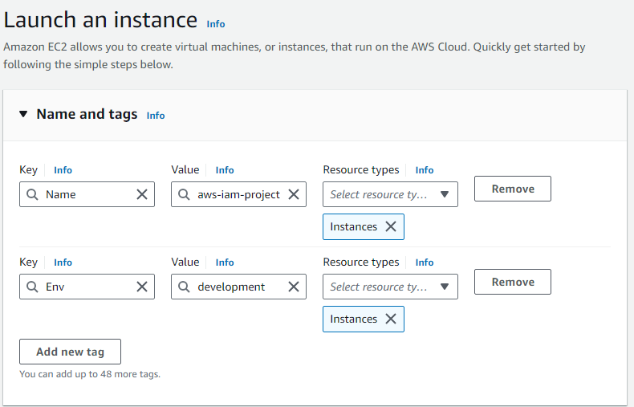

# CLOUD SECURITY WITH AWS IAM
## INTRODUCTION

In this project I seek to implement an AWS IAM Policy by creating two EC2 instances 'production' and 'development', creating an Alias, Users, and User groups.

I will be creating a JSON IAM Policy that will deny cration and deletion of tags of the production EC2 instance and allow all actions on EC2 instances as a general rule.

Here's the video to the implementation of the project:

### AWS IAM
AWS Identity and Access Management (IAM) is a web service that allows administrators to securely manage access to AWS resources and services.
Some of the key concepts when making an IAM policy are as follows:
1.	**Users and Groups**
Users: Individual accounts that represent people or applications. Users can have their own security credentials.
Groups: Collections of users. You can assign permissions to groups, making it easier to manage access for multiple users.
2.	**Roles**
IAM roles are similar to users but are intended for use by AWS services or applications. They allow applications or services to assume permissions without needing long-term credentials.
3.	**Policies**
Policies are JSON documents that define permissions. They specify what actions are allowed or denied on which resources. Policies can be attached to users, groups, or roles.
4.	**Permissions**
Permissions dictate what actions a user or role can perform on AWS resources. For example, permissions can allow users to read from an S3 bucket or launch EC2 instances.
5.	**Multi-Factor Authentication (MFA)**
IAM supports MFA, which adds an extra layer of security by requiring users to provide a second form of identification in addition to their password.
6.	**Best Practices**
•	Least Privilege: Grant only the permissions necessary for users to perform their tasks.
•	User Groups: Manage permissions by assigning them to groups instead of individual users.
•	Enabling MFA: Enhancing security by requiring MFA for sensitive operations.
•	Regularly Review Permissions: Periodically checking and adjusting permissions as needed.

## PROJECT CONSTRUCTION
In this project I used AWS IAM today to create a user group for other people to join in to have access to two EC2 instances and set up specific permissions for the users/user groups.
**Tags**
To get information about the resources used the EC2 instances have an assigned Env (Environment) tag for both the instances. The first instance named aws-iam-project-vandana-1 has the Env tag with the value set as production. The second instance names aws-iam-project-vandana-2 has the Env tag with the value set as development.

### IAM Policies
IAM Policies are rules that help to deny or allow user’s /’resources’ permissions to perform certain actions to my AWS Account’s Resources.
1.	**The Policy set up for this project is as follows:**
•	The policy has been set up using a JSON Editor.
•	The policy I’ve created allows all EC2 related actions to all EC2 instances in the Env Tag “development”. Furthermore, it denies the creation and deletion of all EC2 instances.
2.	**Effect, Action & Resource for the JSON Policy**
•	Effect: Allow or Deny i.e. Denying deletion and creation of tags for EC2 instances.
•	Action: the specific action we are allowing or denying i.e. allowing all related actions for the Env Tag “development” and denying creation and deletion of tages for all EC2 instances. 
•	Resource: The specific resource(s) in the admin(s) AWS account that this policy applies to i.e. my EC2 instances.
3.	**The JSON IAM Policy:**
aws-iam-project-vandana-development-policy

 

### ACCOUNT ALIAS
An account alias is a custom name that can be assigned to the administrator’s AWS account. This custom name will replace the Admins account Id (identifier) in the AWS account’s log-in URL.
Creating the account is simple and can be accessed in the IAM dashboard.
My new AWS console sign-in URL for this project is https://yvandana-project-alias.signin.aws.amazon.com/console 

### IAM USERS AND USER GROUPS
#### Users
IAM users are the other log-in’s or people who have access to the admin(s) AWS Account. These users are given permissions and access to the resources on the AWS account using the AWS IAM service.
#### User Group
IAM User Groups are a set of people who have access to my AWS Account’s resources according to specific polices at a group level.
I have attached the policy that I created for a aws-iam-project-vandana-user-group for my AWS Account’s EC2 instances. All the users that are added to this user group will automatically inherit the user group’s access privileges and permissions.

### LOGGING IN AS AN IAM USER
There are two ways to give access to users to my AWS Account. One way is to email the sign-in instructions and the other being to download a .csv file.
My new user has a unique sign-in URL aws-iam-project-vandana.

## TESTING IAM POLICIES
### LOGGING IN AS A USER
To test the policy, I logged to AWS in an Incognito Tab and went to https://yvandana-project-alias.signin.aws.amazon.com/console
This led me to the AWS log in page where I entered the following details:
1.	My Alias: yvandana-iam-project 
2.	IAM Username: aws-iam-project-vandana
3.	Password as shown in the documentation previously.
Once I logged in my dashboard had stark differences when compared to my regular dashboard. Some of the differences were how I could access my applications and was denied access to cost and usage as shown in the image below.

### STOPPING THE INSTANCES
#### Stopping the Production Instance
I tested my JSON IAM Policy by first trying to stop the EC2 ‘production’ instance i.e. triggering the Stop Instances action which gave me an error message as intended in my policy.
The error message explained that I am not authorized to strop the production instance.

#### Stopping the Development Instance
To test the IAM Policy further I tried to stop the development instance i.e. triggering the Stop Instances action which I was able to do successfully. Further adhering to my JSON IAM Policy.
The success message explained that it had successfully initiated stopping of the development instance.

## CONCLUSION
To conclude, in this project I successfully created JSON IAM policies that worked successfully on two EC2 instances.
Here is what the project enabled me to do:
1.	Create 2 EC2 Instances ‘production’ and ‘development’.
2.	Created an Alias: yvandana-iam-project
3.	Created Users: aws-iam-project-vandana
4.  Created a JSON IAM Policy: aws-iam-project-vandana-development-policy that applies to EC2 instances.
5.	Created a User Group ‘aws-iam-project-group’ that applies the JSON IAM Policy ‘aws-iam-project-vandana-development-policy’
6.	Tested the IAM Policy successfully.
